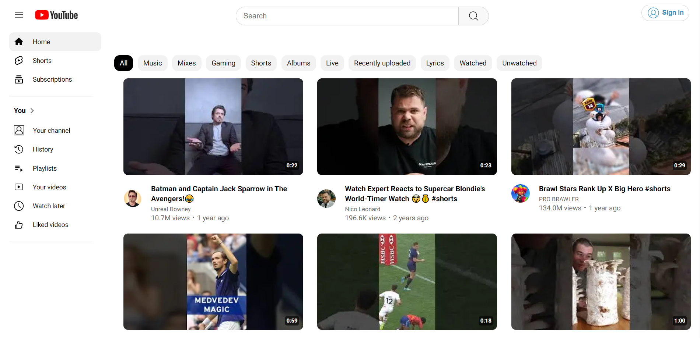

# Youtube clone

Youtube clone with the real Youtube Data

## Technologies Used

- Frontend: Next, Typescript, CSS
- Backend: Node.js, Express.js
- Database: MongoDB
- Authentication: JSON Web Tokens (JWT)
- Docker

## Installation

To run the website locally, follow these steps:

1. Clone this repository.
2. Clone backend repository: https://github.com/nanooka/youtube-clone-backend
3. Clone Docker setup: https://github.com/nanooka/youtube-clone-docker
4. Navigate to the project directory.
5. Install dependencies by running npm install.
6. Set up environment variables for configuration, such as docker, database connection string, API keys for users, etc.
7. Buil and Run docker.
8. Run the backend server using npm run start.
9. Navigate to the client directory and start the frontend application using npm run dev.

## Contact

If you have any questions, suggestions, or concerns, please don't hesitate to contact me at nana.grdzelishvili7@gmail.com. I appreciate your feedback!
